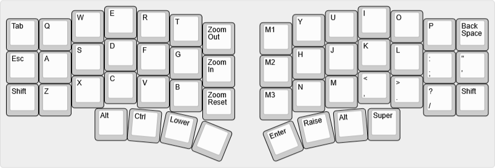
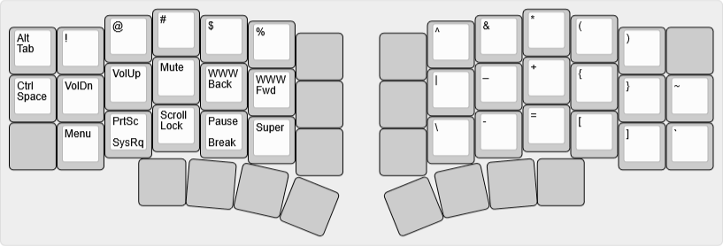
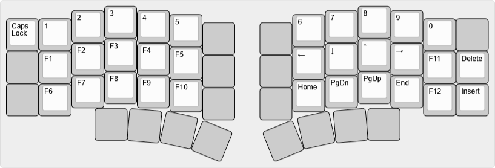
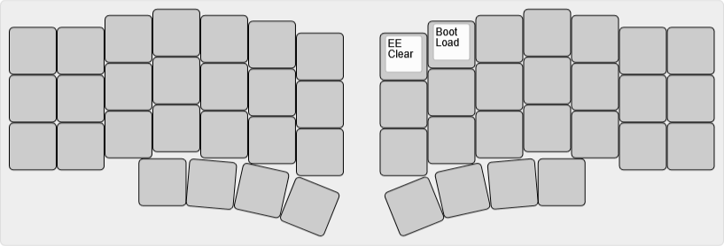

# bcat's Altair-X layout

The [Altair-X](https://ai03.com/projects/altair/) is custom split ergo,
essentially a high-profile Crkbd with an extra key on each bottom row and three
macro keys on each side.

Layout notes

* Based on [split 3x6+3](/layouts/split_3x6_3/bcat) layout. See that page for
  detailed rationale on keymap design.
* The leftmost bottom row key is mapped to Alt, enabling easier access to combos
  like Alt+F4.
* The rightmost bottom row key is mapped to Super rather than just hiding it in
  a layer.
* The left macro keys are mapped to browser zoom hotkeys, which are annoying to
  press otherwise.
* The right macro keys are mapped to Ctrl+Shift+1 through Ctrl+Shift+3: generic
  hotkeys that tend to be free for configuration in various applications.

| Default layer ([KLE](https://www.keyboard-layout-editor.com/#/gists/45acb37c9686c23498b04f370aa7ab0e)) |
| :-: |
|  |

| Lower layer ([KLE](https://www.keyboard-layout-editor.com/#/gists/dce6f730978a7e1538fd08e21415388d)) |
| :-: |
|  |

| Raise layer ([KLE](https://www.keyboard-layout-editor.com/#/gists/a937f1b889842d7532dd8ba78c1bc2a5)) |
| :-: |
|  |

| Adjust layer (Lower+Raise, [KLE](https://www.keyboard-layout-editor.com/#/gists/437ce871d4e709ce920a5cb39f026ae3)) |
| :-: |
|  |
