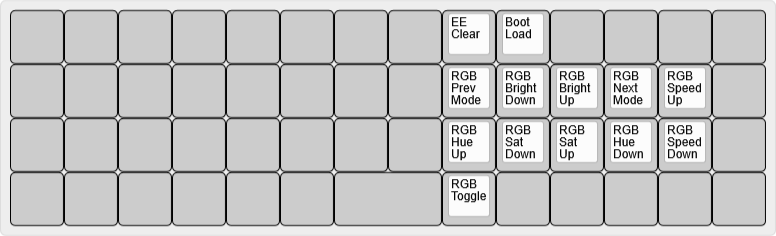

# bcat's Eco layout

This is a cute little 4x14 ortholinear keyboard that uses every IO pin available
on a Pro Micro (or compatible) controller.

Layout notes

* Based on [split 3x6+3](/layouts/split_3x6_3/bcat) layout. See that page for
  detailed rationale on keymap design.
* The alpha keys are spaced around the middle two columns, providing a little
  more hand separation, similar to a split keyboard.
* The top three rows of the extra middle columns feature navigation keys and
  brackets/braces. I don't really use dedicated keys for these, but I had the
  keycaps, so I figured I may as well put them there.
* I have a Left Alt and Right Super key on the bottom row just like my
  [Altair-X](/keyboards/ai03/altair_x/keymaps/bcat).
* The two keys in each bottom corner are unbound, as is the 2U spacebar in the
  center of the bottom row. These keys are too inconvenient to reach, and
  there's nothing really useful to bind them to anyway.

| Default layer ([KLE](http://www.keyboard-layout-editor.com/#/gists/2c11371c7a5f7cd08a0132631d3d3281)) |
| :-: |
|  |

| Lower layer ([KLE](http://www.keyboard-layout-editor.com/#/gists/11256970dc0552886a82382ee02fa415)) |
| :-: |
|  |

| Raise layer ([KLE](http://www.keyboard-layout-editor.com/#/gists/308a8be75e0b85902dc18db1b2546862)) |
| :-: |
|  |

| Adjust layer (Lower+Raise, [KLE](http://www.keyboard-layout-editor.com/#/gists/b18aafa0327d7e83eaf485546c067a21)) |
| :-: |
|  |
