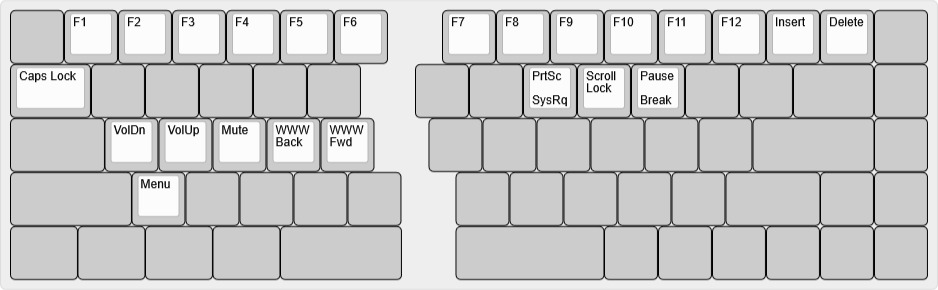

# bcat's Quefrency 65% layout

This is a standard 65% keyboard layout, with a split spacebar, an HHKB-style
(split) Backspace plus function layer, and RGB controls in the adjust layer (on
the arrow/nav keys).

| Default layer ([KLE](http://www.keyboard-layout-editor.com/#/gists/60a262432bb340b37d364a4424f3037b)) |
| :-: |
|  |

| Function layer ([KLE](http://www.keyboard-layout-editor.com/#/gists/59636898946da51f91fb290f8e078b4d)) |
| :-: |
|  |

| Adjust layer (Left Fn+Right Fn, [KLE](http://www.keyboard-layout-editor.com/#/gists/ffc2064d6b2f6a4721a3a4c6124e4ea8)) |
| :-: |
|  |
