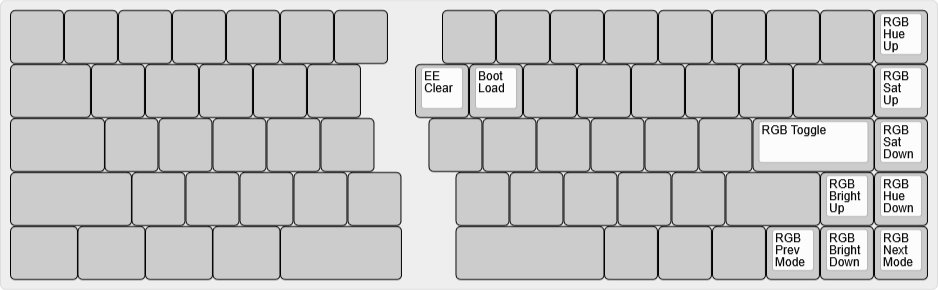

# bcat's Quefrency 65% layout

This is a standard 65% keyboard layout, with a split spacebar, an HHKB-style
(split) Backspace, media controls in the function layer (centered around the
ESDF cluster), and RGB controls in the adjust layer (on the arrow/nav keys).

## Default layer

([Keyboard Layout
Editor](http://www.keyboard-layout-editor.com/#/gists/60a262432bb340b37d364a4424f3037b))

## Function layer

([Keyboard Layout
Editor](http://www.keyboard-layout-editor.com/#/gists/59636898946da51f91fb290f8e078b4d))

## Adjust layer

([Keyboard Layout
Editor](http://www.keyboard-layout-editor.com/#/gists/ffc2064d6b2f6a4721a3a4c6124e4ea8))
