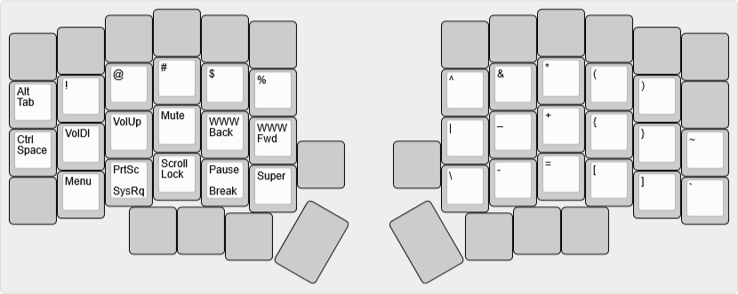

# bcat's Lily58 layout

This split ergo keyboard features 4x6 columnar-staggered keys and 4 thumb keys
per side.

Layout notes

* Based on [split 3x6+3](/layouts/split_3x6_3/bcat) layout. See that page for
  detailed rationale on keymap design.
* There's an optional number row at the top of the keyboard. I am quite used to
  using layers for numbers and symbols, so in practice this goes unused.
* The dedicated Hyphen/Underscore and Equals/Plus keys on the number row are
  placed in the same positions as on the ErgoDox EZ. (There's no real reason for
  this; I just had to do _something_ with those keys.)
* The extra bottom row keys are mapped to Alt and Super for convenience, just as
  they are on my [Altair-X](/keyboards/ai03/altair_x/bcat).
* The additional keys below the controllers are bound to browser zoom keys.

| Default layer ([KLE](http://www.keyboard-layout-editor.com/#/gists/e0eb3af65961e9fd612dcff3ddd88e4f)) |
| :-: |
|  |

| Lower layer ([KLE](http://www.keyboard-layout-editor.com/#/gists/19ad0d3b5d745fbb2818db09740f5a11)) |
| :-: |
|  |

| Raise layer ([KLE](http://www.keyboard-layout-editor.com/#/gists/912be7955f781cdaf692cc4d4c0b5823)) |
| :-: |
|  |

| Adjust layer (Lower+Raise, [KLE](http://www.keyboard-layout-editor.com/#/gists/8f6a3f08350a9bbe1d414b22bca4e6c7)) |
| :-: |
|  |
