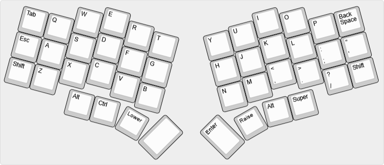
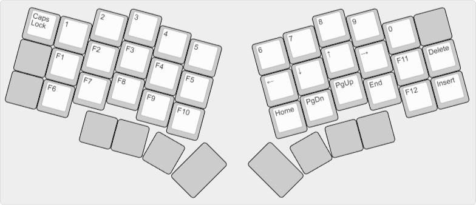
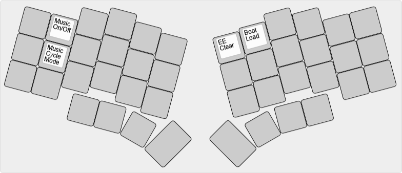

# bcat's Unicorne layout

The [Unicorne](https://github.com/yanghu/unicorne) keyboard is an un-split Crkbd
with slightly altered columnar stagger and two extra thumb keys (including
rotary encoder compatibility).

Layout notes

* Based on [split 3x6+3](/layouts/split_3x6_3/bcat) layout. See that page for
  detailed rationale on keymap design.
* I built my Unicorne without encoders, as I've always found them a fun gimmick,
  but not something I regularly use.
* Instead, the extra bottom row keys are mapped to Alt and Super for
  convenience, just as they are on my
  [Altair-X](/keyboards/ai03/altair_x/keymaps/bcat).
* Since the Unicorne has a speaker, I added bindings on the Adjust layer to
  activate and configure QMK's [music
  mode](https://docs.qmk.fm/features/audio#music-mode).
* Finally, an adorable unicorn prances on the OLED, running faster the quicker
  you type.

| Default layer ([KLE](http://www.keyboard-layout-editor.com/#/gists/b6d0b16a913e7d1faeafc9fc751c413f)) |
| :-: |
|  |

| Lower layer ([KLE](http://www.keyboard-layout-editor.com/#/gists/99dd65d3b857a272be7a1804b20bc266)) |
| :-: |
|  |

| Raise layer ([KLE](http://www.keyboard-layout-editor.com/#/gists/cf9e899867763dc45b65917ce4cf93ff)) |
| :-: |
|  |

| Adjust layer (Lower+Raise, [KLE](http://www.keyboard-layout-editor.com/#/gists/7eb0f1c437169f30cc18eac271ad2302)) |
| :-: |
|  |
