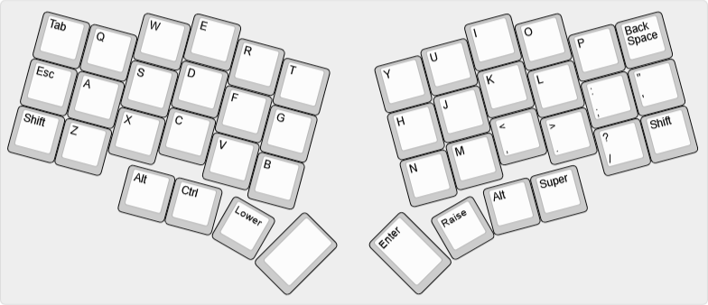
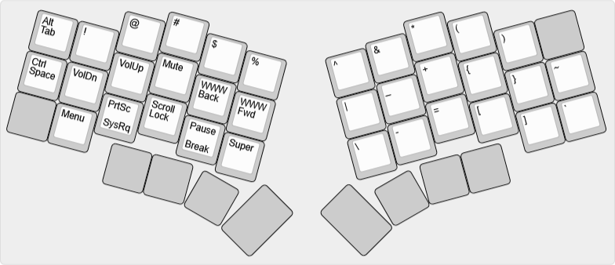
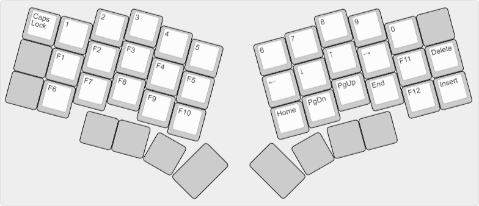
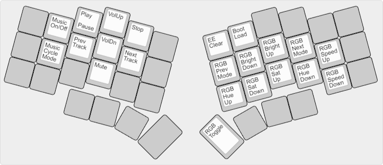

# bcat's Unicorne layout

This ergo layout follows my preferred [split 3x6 + 3 thumb
keys](/layouts/split_3x6_3/bcat) layout, adding bindings for the two rotary
encoders on the bottom row. (The left encoder scrolls vertically and the right
encoder adjusts volume.) Also, since the Unicorne keyboard has a speaker, I
added bindings on the adjust layer to activate and configure music mode.
Finally, an adorable unicorn prances on the OLED, running faster the quicker you
type.

## Default layer

* [Keyboard Layout
  Editor](http://www.keyboard-layout-editor.com/#/gists/b6d0b16a913e7d1faeafc9fc751c413f)

## Lower layer

* [Keyboard Layout
  Editor](http://www.keyboard-layout-editor.com/#/gists/99dd65d3b857a272be7a1804b20bc266)

## Raise layer

* [Keyboard Layout
  Editor](http://www.keyboard-layout-editor.com/#/gists/cf9e899867763dc45b65917ce4cf93ff)

## Adjust layer

* [Keyboard Layout
  Editor](http://www.keyboard-layout-editor.com/#/gists/7eb0f1c437169f30cc18eac271ad2302)
