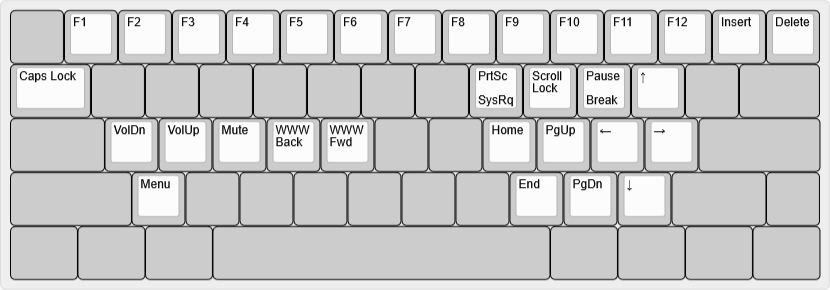

# bcat's 60% ANSI (split Backspace, Right Shift) layout

This layout features an HHKB-style split Backspace and Right Shift together with
a standard ANSI bottom row. It's not my favorite layout, but can be useful when
a keycap set only includes a 6.25u spacebar.

Layout notes

* Based on [60% Tsangan](/layouts/60_ansi_tsangan_split_bs_rshift/bcat) layout.
  See that page for detailed rationale on keymap design.
* The additional bottom row position is mapped to the Menu key.

| Default layer ([KLE](http://www.keyboard-layout-editor.com/#/gists/327b41b5a933b3d44bf60ca9822e85dc)) |
| :-: |
|  |

| Function layer ([KLE](http://www.keyboard-layout-editor.com/#/gists/c7a55e75285d474b6301140eaf53f915)) |
| :-: |
|  |

| Adjust layer (Left Fn+Right Fn, [KLE](http://www.keyboard-layout-editor.com/#/gists/6e1068e4f91bbacccaf5ac0acbeec79c)) |
| :-: |
|  |
