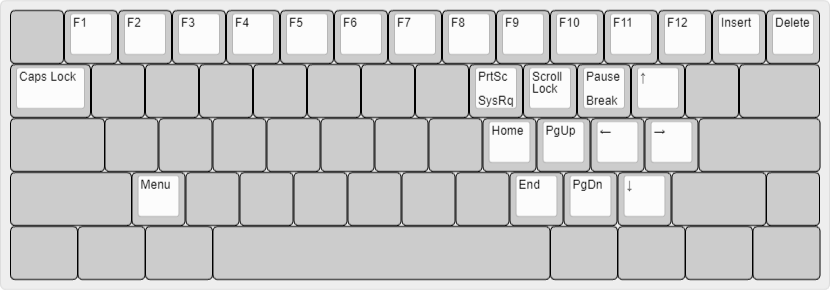
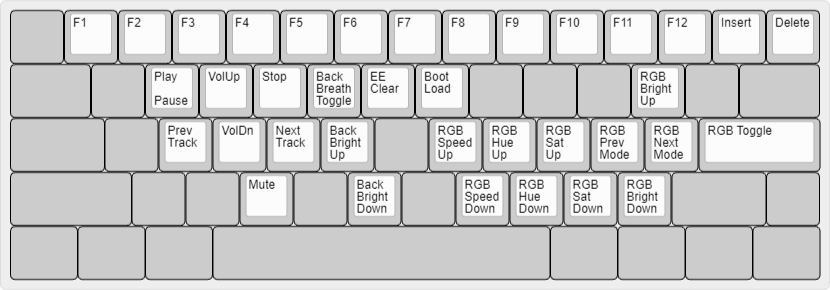

# bcat's 60% ANSI layout with split Backspace and Right Shift

This is a hybrid of a Tsangan/HHKB layout and a standard ANSI bottom row. It's
not my favorite layout, but it's nice enough if you only have a 6.25u spacebar.
Other than the bottom row, this is identical to my regular [Tsangan
layout](/layouts/60_tsangan_hhkb/bcat).

## Default layer

([Keyboard Layout Editor](http://www.keyboard-layout-editor.com/#/gists/327b41b5a933b3d44bf60ca9822e85dc))

## Fn layer

([Keyboard Layout Editor](http://www.keyboard-layout-editor.com/#/gists/c7a55e75285d474b6301140eaf53f915))

## Fn2 layer

([Keyboard Layout Editor](http://www.keyboard-layout-editor.com/#/gists/6e1068e4f91bbacccaf5ac0acbeec79c))
