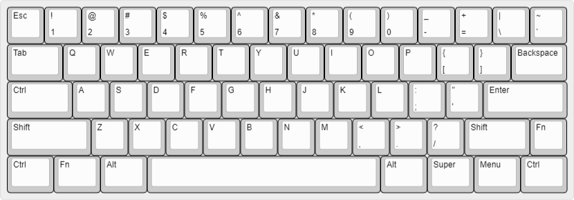
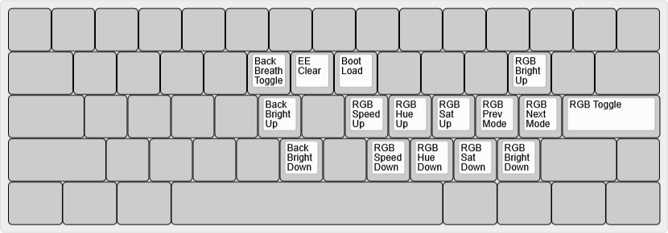

# bcat's 60% ANSI layout with split Backspace and Right Shift

This layout features an HHKB-style split Backspace and Right Shift together with
a standard ANSI bottom row. It's not my favorite layout, but can be useful when
used with a keycap set that only includes a 6.25u spacebar. This keymap is
configured identically to my preferred [Tsangan
layout](/layouts/60_tsangan_hhkb/bcat), with the additional bottom row position
mapped to the Menu key.

## Default layer

* [Keyboard Layout
  Editor](http://www.keyboard-layout-editor.com/#/gists/327b41b5a933b3d44bf60ca9822e85dc)

## Function layer

* [Keyboard Layout
  Editor](http://www.keyboard-layout-editor.com/#/gists/c7a55e75285d474b6301140eaf53f915)

## Adjust layer

* Activated by holding the Left Fn and Right Fn keys simultaneously.

* [Keyboard Layout
  Editor](http://www.keyboard-layout-editor.com/#/gists/6e1068e4f91bbacccaf5ac0acbeec79c)
