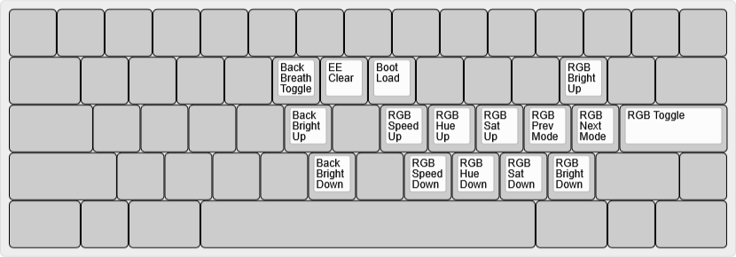

# bcat's 60% ANSI Tsangan (split Backspace, Right Shift) layout

This is a Tsangan layout based on the [HHKB layout](https://hhkb.io/layout/)
with some [DIP switch](https://hhkb.io/components/controllers/) setting changes,
plus a few more tweaks. (I use this layout with both standard 60% cases and ones
with HHKB blockers.)

Layout notes

* The Delete key is mapped as Backspace (SW3).
* The Alt and Super keys are swapped to put Alt directly adjacent to the
  spacebar (SW5).
* The Left Super key is replaced with another Fn key (SW4). This enables F1
  through F6 to be typed with the left hand, without taking the right hand off
  the mouse, which is quite useful while gaming.
* When both Fn keys are pressed simultaneously, an "adjust layer" activates to
  allow keyboard configuration. (This is similar to QMK's [tri-layer
  feature](https://docs.qmk.fm/#/feature_tri_layer) commonly used on ortholinear
  keyboards, except that the Left Fn and Right Fn keys both active the same
  function layer when pressed on their own.)
* The adjust layer contains reset keys, RGB underglow, and backlight controls
  (in place of the arrow and navigation keys).
* The leftmost and rightmost bottom row keys are mapped to Ctrl rather than
  anything more useful because many of my Tsangan PCBs have HHKB-layout plates
  and/or blockers, and so it's not even guaranteed there are switches installed
  in these positions.

| Default layer ([KLE](http://www.keyboard-layout-editor.com/#/gists/86b33d75aa6f56d8781ab3d8475f4e77)) |
| :-: |
|  |

| Function layer ([KLE](http://www.keyboard-layout-editor.com/#/gists/f6311fd7e315de781143b80eb040a551)) |
| :-: |
|  |

| Adjust layer (Left Fn+Right Fn, [KLE](http://www.keyboard-layout-editor.com/#/gists/65ac939caec878401603bc36290852d4)) |
| :-: |
|  |
