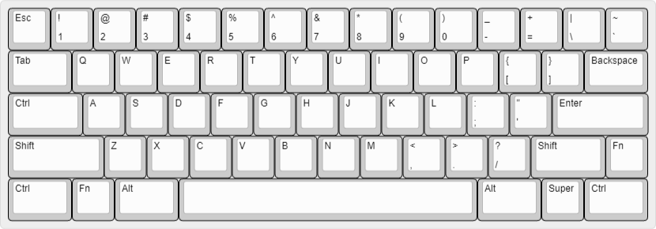
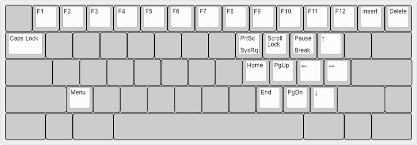
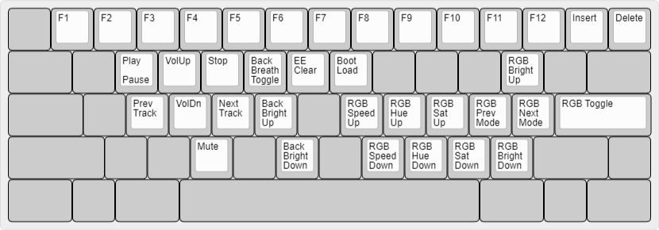

# bcat's 60% ANSI Tsangan HHKB layout

This is a Tsangan/HHKB (split backspace, split right shift) layout following the
[traditional HHKB layout](https://hhkb.io/layout/) with some custom [DIP
switch](https://hhkb.io/components/controllers/) settings and a few more tweaks:

* The Delete key is mapped as Backspace (SW3).

* The Alt and Super keys are swapped to put Alt directly adjacent to the
  spacebar (SW5).

* The left Super key is replaced with another Fn key (SW4). Unlike on the
  original HHKB, this key triggers an Fn2 layer that's distinct from the normal
  Fn layer.

* The Fn2 layer contains reset keys, RGB underglow and backlight controls (in
  place of the arrow and navigation keys), and media controls (centered around
  the ESDF cluster).

* The Fn2 layer also has the F1-F12 keys mapped just like the Fn layer. This is
  a concession to gaming because it enables these keys to be easily typed with
  the left hand, without taking the right hand off the mouse.

* The leftmost and rightmost bottom row keys are mapped to Ctrl rather than
  anything more useful because most of my Tsangan PCBs actually have HHKB plates
  and/or blockers, so there likely aren't switches installed in those positions.

## Default layer

([Keyboard Layout
Editor](http://www.keyboard-layout-editor.com/#/gists/86b33d75aa6f56d8781ab3d8475f4e77))

## Fn layer

([Keyboard Layout
Editor](http://www.keyboard-layout-editor.com/#/gists/f6311fd7e315de781143b80eb040a551))

## Fn2 layer

([Keyboard Layout
Editor](http://www.keyboard-layout-editor.com/#/gists/65ac939caec878401603bc36290852d4))
