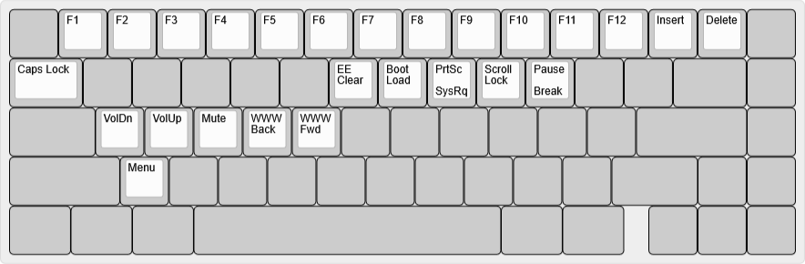

# bcat's 65% ANSI layout with blocker and split Backspace

This is a standard 65% keyboard layout, with a blocker to the left of the arrow
keys and an HHKB-style (split) Backspace.

| Default layer ([KLE](http://www.keyboard-layout-editor.com/#/gists/dd675b40cc4df2c7bb78847ac29f5988)) |
| :-: |
|  |

| Function layer ([KLE](http://www.keyboard-layout-editor.com/#/gists/f29128427f674c43777f045e363d1b44)) |
| :-: |
|  |
