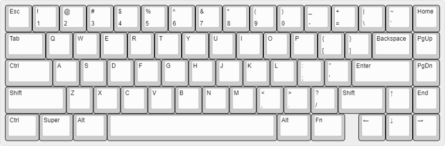
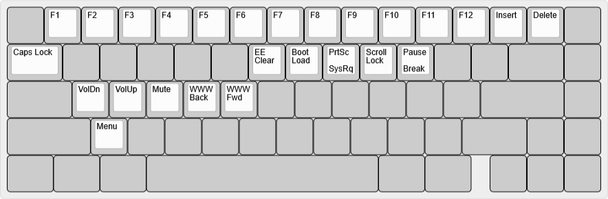

# bcat's 65% ANSI layout with blocker and split Backspace

This is a standard 65% keyboard layout, with a blocker to the left of the arrow
keys, an HHKB-style (split) Backspace, and media controls in the function layer
(centered around the ESDF cluster).

## Default layer

([Keyboard Layout
Editor](http://www.keyboard-layout-editor.com/#/gists/dd675b40cc4df2c7bb78847ac29f5988))

## Function layer

([Keyboard Layout
Editor](http://www.keyboard-layout-editor.com/#/gists/f29128427f674c43777f045e363d1b44))
