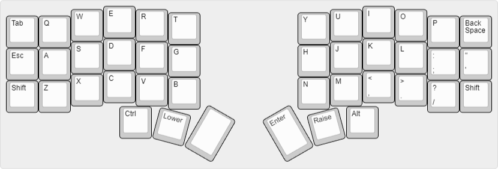
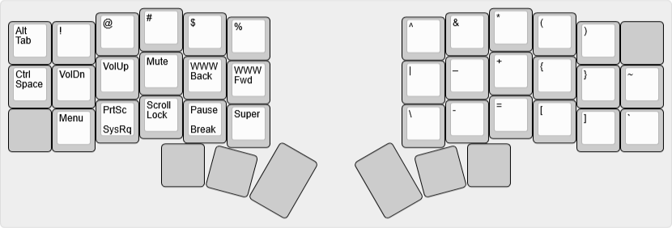
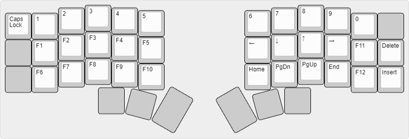
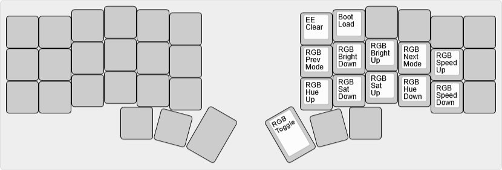

# bcat's 3x6+3 split layout

This is my preferred split ergo layout for typing. It is loosely inspired by the
default Planck (symbols on Lower, numbers on Raise) and Crkbd (Space on left,
Enter on right) layouts, but has since been redesigned heavily according to the
principles described below.

Layout notes

* This layout features the four traditional [ortho/ergo
  layers](https://docs.qmk.fm/#/feature_tri_layer) (default, lower, raise,
  adjust).
* Since my most-frequently-used keyboard shortcuts involve Ctrl, which lives on
  the left half of the keyboard, keys frequently used with it (numbers, function
  keys, etc.) are on the raise layer activated by the right thumb.
* Navigation can be done on the right half alone, to enable simultaneous
  left-handed mousing. Additionally, Web pages can be scrolled with Space or
  Shift+Space on the left half alone, to enable taking notes with the right hand
  at the same time.
* Other than Right Shift (which I seldom use), mods aren't rebound on layers.
* Likewise, Backspace is not rebound on layers to avoid having to let go of
  layer-switch keys to correct mistakes.

| Default layer ([KLE](http://www.keyboard-layout-editor.com/#/gists/08d9827d916662a9414f48805aa895a5)) |
| :-: |
|  |

Default layer notes

* The alpha keys are a standard QWERTY layout, no funny business there.
* Tab and Backspace are in familiar locations from my row-staggered boards
  (almost all of which use HHKB-style split backspace).
* The Esc key is next to the home row for convenience in Vim.
* There are two Shift keys, although I generally use Left Shift. (I've
  considered replacing Right Shift with another key, but haven't chosen one.)
* Lower and Raise layer-switch keys are in the resting position of my left and
  right thumbs, respectively.
* Space and Enter are on the big thumb keys so they're easy to press.
* Ctrl is on the left for ease of chording, especially one-handed use of common
  shortcuts like Ctrl+T and Ctrl+W. This puts Alt on the right by the process of
  elimination. (I would really like one more 1U thumb key on each half to allow
  for a redundant Alt key on the left and a dedicated Super key on the right.)

| Lower layer ([KLE](http://www.keyboard-layout-editor.com/#/gists/c3fba5eaa2cd70fdfbdbc0f9e34d3bc0)) |
| :-: |
|  |

Lower layer notes

* This could also be called the "symbol layer".
* Shifted numbers are bound in their usual positions on the top row.
* Hyphen/Underscore and Equals/Plus are in the right index- and middle-finger
  columns for easy reach. They share the same relative position as on a
  row-staggered keyboard, and the shifted versions are physically above the
  unshifted versions as a mnemonic device.
* Brackets and braces are placed below the parens for easy recall. Once again,
  the shifted versions are on the home row and the unshifted versions are on the
  bottom row.
* Forward Slash/Pipe and Backtick/Tilde fill out the remaining positions on the
  right half, with the same relative positions as on a row-staggered HHKB
  layout. And yup, the shifted versions are above the unshifted versions.
* Remaining keys from a TKL are placed out of the way on the bottom row of the
  left half.
* The home row on the left half contains volume and browser navigation hotkeys.
* Lower+Esc is bound to Ctrl+Space because the Ctrl and Space keys are both on
  the left thumb, so this key combination (which I use for tmux prefix and
  editor autocomplete) is hard to press in its natural location.
* Lower+Tab is bound to a custom Alt+Tab macro that keeps the Alt modifier held
  as long as the Lower key is held down. This means that window switching is on
  Lower+Tab immediately next to browser tab switching (Ctrl+Tab).

| Raise layer ([KLE](http://www.keyboard-layout-editor.com/#/gists/08b44355d4ca85d294bad9e2821f91d7)) |
| :-: |
|  |

Raise layer notes

* This could also be called the "number layer".
* Unshifted numbers are bound in their usual positions on the top row.
* Arrow keys are on VIM-style HJKL keys.
* Home/End and Page Up/Page Down are in the same column as the arrow keys, but
  translated down one row. (This means that the comma and period keys are not
  bound on the number layer, which makes data entry a bit funky. I might add a
  dedicated numpad layer to compensate.)
* Function keys F1–F10 take up most of remaining space on the left half, with
  F11 and F12 spilling over to the right half. (This puts the most used function
  keys (F1–F5) on the home row.)
* Insert and Delete are on the rightmost column, because there didn't seem to be
  a better place to put them.
* Caps Lock is bound in the same position as on an HHKB, for lack of an obvious
  better location.

| Adjust layer (Lower+Raise, [KLE](http://www.keyboard-layout-editor.com/#/gists/77e7572e077b36a23eb2086017e16fee)) |
| :-: |
|  |

Adjust layer notes

* Reset keys live at the top-left corner of the right half where it's
  reasonably hard to press them by accident.
* Navigation keys are replaced by RGB controls. This mirrors the positioning I
  use on my row-staggered keyboards.

